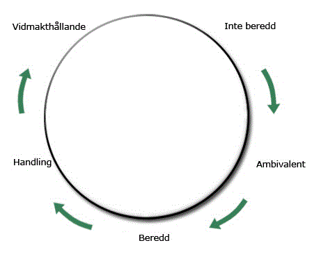

```{r setup, include=FALSE}
library(tufte)
# invalidate cache when the tufte version changes
knitr::opts_chunk$set(tidy = FALSE, echo=FALSE, cache.extra = packageVersion('tufte'))
options(htmltools.dir.version = FALSE)
```


"Vi anpassar oss helt enkelt till vad kunden vill ha." Så skriver [Henrik Tjärnström i Dagens Industri](http://www.di.se/artiklar/2016/8/26/debatt-spelbolagen-maste-jobba-ihop/) som förklaring på varför de privata spelbolagen... finns? bör legitimeras? behövs? Oavsett har han i stora delar rätt.

I en öppen ekonomi röstar folk med plånboken. De privata spelbolagen får onekligen en hel del röster. Endast naiva tonårsliberaler påstår dock att detta är hela sanningen. Att folk betalar för något är inte samma sak som att de vill ha det. *Homo economicus* är död, om hen någonsin funnits.

`r tufte::newthought("Ett mått på spelproblem")` är inte automatiskt handlingsbart. Ett spelbolag kan använda det [att sätta mål](http://rpubs.com/halhen/metrics) och en lagstiftare att [sätta regelverk](http://rpubs.com/halhen/farliga-spel). Men, hör man ofta sägas, vi kan ju inte säga till vuxna människor vad de ska göra. Vi ska inte ta oss rätten att tränga på. Och även detta är till största delen sant. Det är oftast fel att sätta sig över vuxna människors fria vilja. Det lär heller inte hjälpa; folk har en förvånande envishet att göra vad de vill, oavsett vad andra tycker.

Men härmed är diskussionen inte slut. Tvärtom har den bara börjat. Ett fungerande spelansvar utgår inte från vad *vi* vill. Det utgår från vad *spelaren* vill.


`r tufte::newthought("Förändringshjulet")` är en standardmodell för att beskriva den process människor går igenom när de vill ändra något. För diskussionens skull kommer jag att förenkla modellen en smula. En mer komplett artikel på temat finns [hos Folkhälsan](https://www.folkhalsomyndigheten.se/somra/forandringens-dynamik/).

För det mesta är folk nödja med sitt beteende. De är åtminstone inte missnöjda nog för att överväga en förändring. Man vet att man har ett par trivselkilon, men man har tillräckligt med jeans i anständig storlek för att ta sig igenom arbetsveckan. Man är *inte beredd* för en förändring.

Efterhand byxorna blir allt trängre och trapporna allt längre, blir man *ambvivalent*. Kanske man borde ta tag i den här vikten. Eller är det verkligen så farligt? Det är jobbigt att banta och vara hungrig, och så kan man ju inte följa med ut på lunch. Och om man bara låter tröjan hänga utanför så... Detta är en jobbig fas. Tankarna slits mellan det som är fel och eländet som skulle krävas för att förändra det.

Till slut bestämmer man sig, och tar *handling*. Om förändringen är framgångsrik behåller man sitt nya beteende. Ofta blir det inte så. En dag finner man sig i soffan med magen full av Ben & Jerrys och bestämmer sig för att man nog ändå behövde lite nya kläder. Man är tillbaka i *inte beredd* och påbörjar snart ett nytt varv i cykeln.

`r tufte::margin_note("Bild: Folkhälsoinstitutet")`




`r tufte::newthought("Det finns ett starkt samband")` mellan förändringsvilja och risk. 

Utifrån min erfarenhet av faktiska spelare finns ett par enkla tumregler. Bland spelare som inte har problem, är de allra flesta *inte beredda* till en förändring. Bland riskspelare^[PGSI 3 - 7] blir bilden annorlunda. Var fjärde riskspelare vill förändra sitt spelande. Bland problemspelarna^[PGSI 8+] är siffran än högre: hälften tycker att det är viktigt att förändra sitt spelande. Förutom dessa finns en stor mängd spelare som fortfarande brottas med sin ambvivalens.

Uppskattningsvis hälften av pengarna i farliga spel kommer från risk- och problemspelare^[PGSI 3+]. Upp mot hälften av dessa spelare vill egentligen inte spela som de gör. Var fjärde krona kommer från någon som inte vill, men gör ändå.

Att man betalar för något är inte samma sak som att man vill ha det. **Vi ger inte dessa kunder vad *de* vill ha. Vi ger dessa kunder vad *vi* vill att de ska vilja ha.**


`r tufte::newthought("Förändring kräver")` två saker: [vill och kan](http://www.behaviormodel.org/). Vi lägger stor möda på att driva spelbeteende. Vi lägger inte tillnärmelsevis samma möda på att stötta den som vill hålla sitt spelande i schack. Om jag, när jag funderade på att sluta röka, hade fått alternativen att prova sluta i a) sex månader, b) ett år, eller c) tre år, hade jag tvärvänt i dörren. 

Visst använder spelare emellanåt spelbolagens gränssättning. Men ofta har man anammat självpåtagna strategier. Spelandets *varannan vatten*, som luttrade män och kvinnor själva tvingats lista ut under åren.

> "*Jag sätter in femhundra efter lön. Om jag vinner får jag spela mer. Om pengarna tar slut får jag vänta till nästa lön.*"

Det jag pratar om är inte behandling. Det är vad som på engelska kallas *empowerment*. Det är att ge dem som vill förmågan. Det är att ge kunden vad den faktiskt vill ha -- kontroll över sitt spelande.

Spel är inte rationellt. Det duger inte att skickligt driva de mest primitiva och irrationella av beteenden i spelen, och sedan rycka på axlarna och peka på rationalitet när det gäller ansvar. Problemspelare har, per definition, tappat förmågan att fatta beslut om sitt spelande. Uttrycket *Informed Choice* är ett slag i ansiktet på dem som drabbats. Att kontrollera impulser med vilja funkar inte.

Naturen skiter högaktningsfullt i vad vi tycker.


`r tufte::newthought("Måttet på framgång")` är vad som funkar. Vad som funkar beror på vad man vill åstadkomma. Spelbolagen har inte spelarnas välmående som första intresse. Så vem ser efter de spelare som själva inte kan? Vems uppgift är det att hjälpa dem som vill? En nationell självavstägning kan vara ett steg i rätt riktning. Finns det mer häråt? Nationell gränssättning? Nationell reklamspärr? Nationell spelsammanställning? Eller är det helt andra saker som vi måste experimentera oss fram till? Oavsett vad måste det börja med att vilja.

Mitt hopp för framtiden ligger i nya, fiffiga lösningar. Spelbolag är ohyggligt duktiga på att driva det beteende man vill uppnå. Man har både verktyg, kunskap och erfarenhet att hjälpa spelarna att ta makten över sina egna beslut. Fungerande lösningar kommer inte från mötesrum eller lagböcker. De kan bara komma från verkligheten. Att hitta dem kräver empati och experimentlusta. Framför allt kräver det vilja. Och här är det tyvärr alltför tunnsått.

De privata spelbolagen kan. Omregleringens uppgift är att se till att de vill.

Vill och kan. Det är så, och bara så, förändring sker.