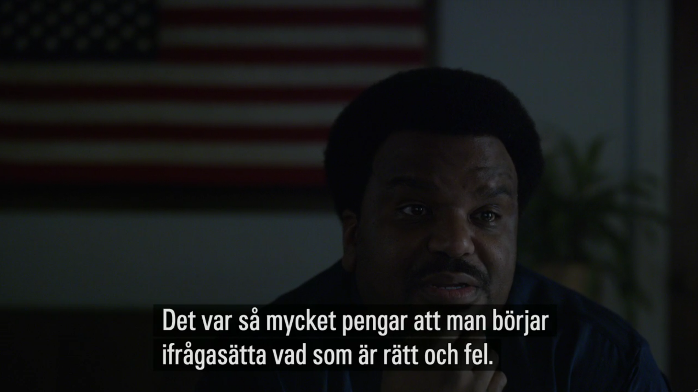

Det har gått några månader sedan BOS och SPER kom överens om att komma överens. Gemensamma intressen behövde trumfa uppdelningen av marknadskakan. Den senare löser vi när den förra är löst. Just nu är de gemensamma fienderna medier, omreglering och sunt förnuft.

Det var först i veckan jag såg det avgjort. Den tysta sommaren kan enkelt förklaras med just sommaren. Men den senaste veckan förvandlades det förr så eldiga Twitter [till](https://twitter.com/GustafHoffstedt/status/779320466351808513) [ett](https://twitter.com/GustafHoffstedt/status/779306757785083908) [kramkalas](https://twitter.com/svspel_samhalle/status/779313840664219648). 

`r tufte::newthought("Det vi nu ser")` är ett arketypisk exempel på professor Bent Flyvbjergs insikter i [Power and Rationality](http://flyvbjerg.plan.aau.dk/Rat&Pow03.pdf). Makt trumfar rationalitet. Än mer, *makt definierar rationalitet*. Och just detta är spelbolagen duktiga på.

Jag jobbade med spelansvar i sex år på Svenska Spel. Det har nog inte gått någon förbi att jag [inte](https://twitter.com/henrik_hallberg/status/778279629018849281) är [imponerad](https://twitter.com/henrik_hallberg/status/778486778231656448) över vårt stats-monopol. Svenska Spel är inte bara skrämmande okunniga och handlingssvaga i spelansvaret, man vill inte. Allt man säger och gör visar det, inte minst debatten.

CSR är en funktion under Svenska Spels Kommunikationsavdelning. Som sådan blir målen man har inte nödvändigtvis i spelarens intresse. CSR under kommunikation blir PR. Man debatterar gärna andras ansvar, men undlåter och tystar debatten för det egna. Det finns en stor portion symbolik i den [uppkommande Spelakademins program](http://spelakademin.se/program/). 85 minuter om brottslighet och 75 minuter om matchfixning, båda fenomen man har inget, eller i bästa fall indirekt, ansvar för. 45 minuter stand-up, för trevlighetens skull. Och så 25 minuter om spelansvar, den faktiska anledningen att man har fått ett monopol.

Varför? För att man vill att det ska vara så.

Eller, som jag hört sägas i mötesrum på just Svenska Spel: *Det här är faktiskt affärer, inte etik och moral.*

Maktens sätt att definiera rationalitet är att avgöra vad som tillåts vara fakta. Perspektiv och kunskap som inte stämmer med den rådande mytologin har alltid tystats på Svenska Spel. Inte genom debatt eller undersökande, utan genom uteslutning och tystnad. För ett halvår sedan hade vi åtminstone en frisk och efterlängtad *publik* debatt. Men nu har maktens män slutit sig samman.

Även den publika debatten har nu tystats.

`r tufte::newthought("Spelberoende är inte behjärtansvärt.")` Få facebookkampanjer rullar för dem som spelat bort familjens pengar. De hamnar långt efter svältande barn, och smältande isar, och misskötta mjölkkor, och svällande dagisklasser, och det mesta annat. Under tiden har maktens män på öppet mål att vända den allmäna blicken från äldre invandrarmän i Second Hand-jacka som utan chans till arbete matar Vegasmaskinen med hundralapp efter hundralapp. Istället vänder man den till bilder på fotbollsspelande barn i kläder som dessa hundralappar betalat.

Ingen får kunskap nog att kunna ifrågasätta sakers tillstånd, och när någon försöker har man sitt [PR-maskineri på plats](http://www.svt.se/nyheter/inrikes/svenska-spel-vegas-ar-ett-hogsriskspel).

Så vad är kvar? Vi återgår förmodligen till att Kim Grahn bjuds som förkläde i diverse debatter och får svara på små ömkande frågor om hur jobbigt det måste varit istället för att bli tagen på allvar. Håkan Hallstedt behöver lämna in ett omregleringsförslag som har någon chans att bli verklighet. Med alla maktens män på samma sida kan detta bara bli en allsång för bas och tenor.

> *Vem ska representera spelaren när maktens män nu har bestämt sig?*

Det finns fortfarande 30.000 spelberoende i Sverige. Det finns 100.000 riskspelare. 75.000 barn lever med någon som inte förmår sig att sluta spela bort pengarna. Var fjärde krona av den svenska spelmaknadens pengar kommer från riskspelande. Ändå pratar vi bara om hur viktiga pengarna är för civilsamhället, eller statskassan, eller för aktieägarna, och hur viktigt det är att man inte kan fuska i fotboll.

Att fortsätta en rationell debatt för problemspelarna i dagens maktstruktur kommer inte att göra någon skillnad. För att debatten ska kunna fortsätta måste media och politiker kräva att så sker. *Om vi vill lösa det här, måste de som bryr sig få maktens hjälp att höras.*

Thomas Nilsson var på åttiotalet en av de första i Sverige som upptäckte fenomenet spelberoende. Han satte tidigt som mål att få hinna se spelberoende inskrivet i socialtjänstlagen. En trettioårig karriär senare ser det ut som att han inte ens kommer att få det. Hans ord summerar sakers tillstånd bättre än någon annans.

<blockquote class="twitter-tweet" data-lang="en">
Sagt i snart 30 år. Nu får det vara nog! Alla vill ha pengarna som spel genererar utan att ta ansvar för de negativa konsekvenserna. Skäms.
&mdash; Thomas Nilsson (@ThomasN56804632) <a href="https://twitter.com/ThomasN56804632/status/545824283252244481">December 19, 2014</a></blockquote>

